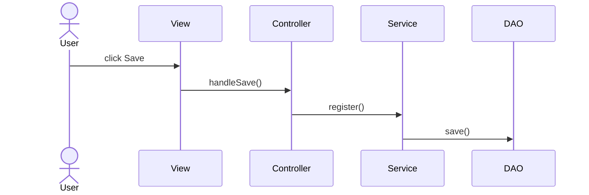

# Register Student - Group Task Presentation

## 1. Layered Architecture View

Our design follows a strict Layered Architecture to separate concerns.

- **Presentation Layer (UI):** `StudentForm.fxml`
  - _Responsibility:_ Displays the layout and controls (buttons, text fields).
  - ↓ _talks to_ ↓
- **Controller Layer:** `StudentController`
  - _Responsibility:_ Listens for the "Save" click, reads user input, and validates basic rules via `handleSave()`.
  - ↓ _talks to_ ↓
- **Service Layer:** `StudentService`
  - _Responsibility:_ Contains the actual business rules and executes the `registerStudent()` command.
  - ↓ _talks to_ ↓
- **Data Access Layer (DAO):** `StudentRepository`
  - _Responsibility:_ Connects to the database and executes `save(Student)` using safe SQL.

---

## 2. UML Sequence Diagram

